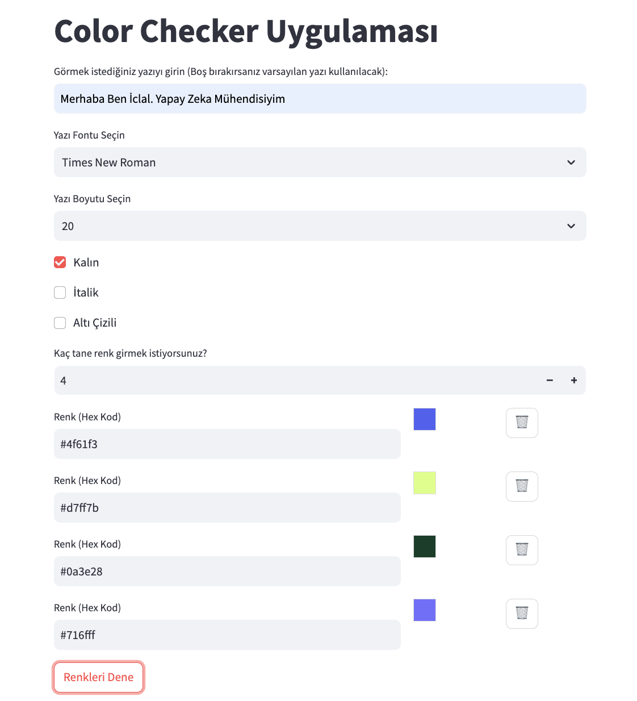
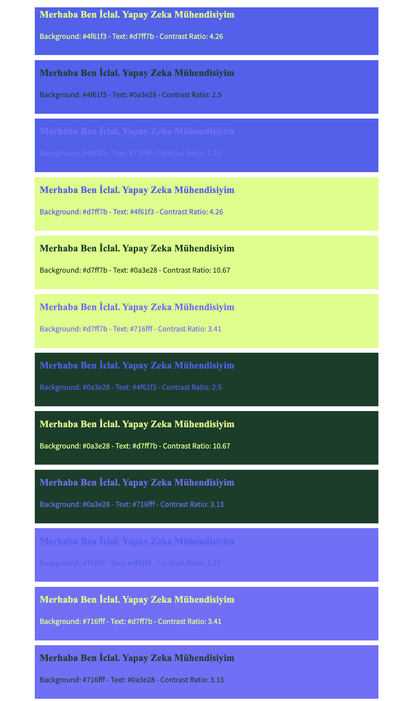

# 🎨 Color Checker Uygulaması

**Color Checker**, kullanıcıların 🎨 çeşitli renk kombinasyonlarını arka plan ve yazı rengi olarak test etmelerine olanak tanıyan 🖥️ bir web uygulamasıdır. Bu uygulama, belirli renk kombinasyonlarının kontrast oranlarını hesaplayarak, görsel olarak nasıl göründüklerini kullanıcıya gösterir. Kullanıcılar, yazı tipi, yazı boyutu ve stil gibi çeşitli özelleştirmeler yapabilirler.

## ✨ Özellikler

- 🖌️ Kullanıcı tarafından belirlenen hex kodları ile renk kombinasyonları oluşturma.
- 📝 Yazı tipi, yazı boyutu ve stil (kalın, italik, altı çizili) seçme.
- 🔍 Arka plan ve yazı rengi kombinasyonlarının kontrast oranlarını hesaplama.
- 🔄 Renk girişlerini görsel olarak gösteren kutucuklar ve silme işlevi.

## 🚀 Kurulum

1. Gerekli kütüphaneleri yükleyin:

    ```bash
    pip install streamlit
    ```

2. Python dosyasını çalıştırın:

    ```bash
    streamlit run app.py
    ```

## 📚 Kullanım

1. Uygulama açıldığında, görmek istediğiniz yazıyı, yazı tipini ve yazı boyutunu seçin.
2. 🎨 Renk sayısını belirleyin ve her bir renk için hex kodlarını girin.
3. "Renkleri Dene" butonuna tıklayarak tüm olası kombinasyonları ve kontrast oranlarını görün.

### Uygulama Ekran Görüntüleri

Kullanıcı arayüzü ve sonuçların örnek çıktıları aşağıda gösterilmiştir:

#### 1. Kullanıcı Arayüzü


Bu ekranda, kullanıcıdan görmek istediği yazıyı ve yazı tipini seçmesi istenir. Renk girişleri için alanlar ve her renk için bir silme butonu bulunmaktadır.

#### 2. Renk Kombinasyon Sonuçları


Bu ekranda, kullanıcının belirttiği renk kombinasyonlarına göre arka plan ve yazı renkleriyle oluşturulmuş örnekler ve bu kombinasyonların kontrast oranları gösterilir.

## 🤝 Katkıda Bulunma

Eğer projeye katkıda bulunmak isterseniz, lütfen bir pull request gönderin veya bir sorun (issue) açın. Her türlü katkı ve geri bildiriminiz bizim için değerlidir! 🙌

